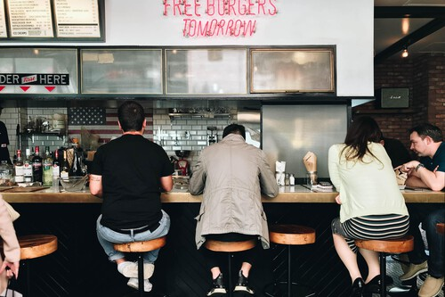

# Se acabó elegir qué quieres comer en un restaurante (al menos si la inteligencia artificial se sale con la suya)

La inteligencia artificial (IA) quiere lograr algo que hasta ahora parecía reservado solo a los padres: saber qué quieres comer antes incluso de que tú mismo lo hayas decidido. Quizás suene a ciencia ficción, quizás resulte incluso distópico, pero en San Francisco hay una compañía que está a punto de lanzar una herramienta con ese propósito: que cuando entres en un local y te acerques a la pantalla para consultar su menú sea el propio dispositivo el que te sugiera un plato.
Uno, por supuesto, ajustado a tus propias características y ánimo.

¿Que tras escanear tu aspecto concluye que lo que te apetece es una buena ensalada con atún? Pues cuando te plantes delante de la pantalla el sistema te mostrará un despliegue con alternativas que giran en torno a esa opción. ¿Que tienes pinta de preferir alitas de pollo, unas costillas bien asadas o una pizza? No hay problema. Eso será lo que veas de entrada en la pantalla.

Todo dentro del menú, claro, y dando al usuario capacidad de decisión.

Ya se sabe: el cliente siempre tiene la última palabra.

---

## Cara de ensalada o cara de hamburguesa

La firma en cuestión se llama Raydiant y empezó especializándose en la señalización digital. Tras crecer en el sector y llevar su tecnología a un buen número de negocios, ahora quiere ir un paso más allá de la mano de la IA. Experiencia no le falta: lleva casi una década, desde 2023, trabajando en el campo. “Los clientes, las empresas, querían usar la analítica para crear mejores experiencias dentro de sus locales”, comenta el responsable de la empresa, Bobby Marhamat, a Quartz.

Ahora ha iniciado la cuenta atrás para lanzar a finales de este mismo año puestos con una IA capaz de ofrecer a cada cliente una experiencia personalizada… Y de paso, claro, aumentar las ventas de los propios negocios. ¿Cómo? Básicamente con cámaras y un sistema capaz de reconocer algunas de las características clave de cada cliente y decidir qué es lo que le apetece comer.

Para concluir si un cliente es un veinteañero o un jubilado llega con fijarse en ciertos rasgos, como las arrugas; pero otras cuestiones, como si está deprimido o alegre pueden resultar bastante menos evidentes. ¿Cómo lo analiza la IA? Jugando con una paleta de factores entre los que se incluye, por ejemplo, la meteorología: “Lo que se identificó es que si está lloviendo y a alguien no le gusta la lluvia, camina con descontento, el estado de ánimo de su rostro se recoge como descontento”.

La idea es meter esa combinar ese cóctel de factores y llegar a una conclusión clave para el negocio: cuando ese cliente en cuestión se asome a la pantalla, ¿Qué le apetecería ver?