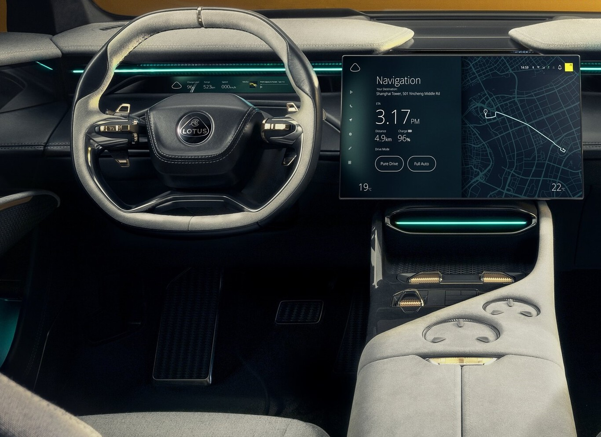

# Lotus Eletre: un SUV eléctrico con pantalla OLED de 15,1 pulgadas no apto para puristas

Es posible que más de un purista haya sufrido una repentina punzada de dolor en el pecho, hacia el lado izquierdo, cuando haya visto lo nuevo de Lotus. Si la confirmación de que Ferrari presentará su propio SUV levantó revuelo (aunque era más que esperado), el Lotus Eletre es muy probable que haya dado más de un disgusto. Aunque este SUV eléctrico deportivo promete cifras de infarto.

## Lotus Eletre, rompiendo moldes

Lotus siempre se ha caracterizado por deportivos muy bajos y livianos, con una dinámica de conducción envidiable. O, lo que es lo mismo, el coche antagónico a lo que se busca hoy en día en el mercado. También en el del lujo. El SUV ha pasado por encima a todos sus rivales y si una marca quiere ser rentable, no le queda otra que pasar por el aro. Porsche fue la primera con su Cayenne y, poco a poco, Lamborghini, Maserati o Ferrari han seguido el mismo camino o lo seguirán muy pronto.

En este contexto, Lotus lo tenía difícil y ha decidido apostar el todo por el todo: SUV y eléctrico. Su próximo gran deportivo llegará en 2023 y será entonces cuando veamos un modelo único en su gama y el destinado a marcar un antes y un después.

Sus cifras lo dicen todo: 5,1 metros de longitud, 2,14 metros de ancho y 1,63 metros de alto. Para hacernos una idea, el Lotus Emira, el último deportivo de la firma no electrificado mide 20 centímetros menos de largo y 40 centímetros menos de alto. Pese a todo, Lotus ha querido cumplir con una de sus máximas y, para reducir el peso, se ha hecho un uso extenso de la fibra de carbono (los elementos negros que contrastan con la carrocería) y del aluminio y el acero en el chasis.

A nivel mecánico, el Lotus Eletre contará con dos motores eléctricos (uno por eje) que entregarán hasta 600 CV y dotarán al SUV de tracción a las cuatro ruedas. Su batería de 100 kWh anuncia una autonomía de 600 kilómetros en el mejor de los casos y admite potencias de carga de hasta 350 kW mediante tecnología de 800 V o hasta 22 kW en corriente alterna. La marca asegura que se pueden contar con hasta 400 kilómetros después de 20 minutos de carga.

## Entrando en la nueva dimensión

Lotus no ha querido sorprender sólo en detalles técnicos, el interior del nuevo Eletre es toda una declaración de intenciones de qué podremos encontrar en sus futuros modelos.

Una tira lumínica horizontal cruza todo el salpicadero y sirve de referencia para dos pequeñas pantallas alargadas (conductor y copiloto) de sólo tres centímetros de alto en las que se muestra información práctica, como los datos esperados en el cuadro de instrumentos, las funciones de climatización o llamadas entrantes. Además, la tira cambia de color en función de la información mostrada.

Pero es en su gran pantalla táctil de 15,1 pulgadas, y tecnología OLED, donde se recoge toda la información relativa a su sistema de infoentretenimiento. Además, los datos aquí mostrados pueden ser proyectados sobre el parabrisas añadiendo, además, funciones de realidad aumentada. La firma de sonido la pone KEF, con 15 altavoces de serie y hasta 23 altavoces bajo pedido. Esta última opción tiene 2.160 W de potencia y tecnología 3D.

En cuanto a ayudas a la conducción y sistemas de seguridad, se emplea con profusión la tecnología LIDAR, con hasta cuatro radares repartidos por la carrocería. Lleva uno situado en la luneta trasera, otro en el parabrisas y otros dos en las aletas de las ruedas delanteras. Éstos, además, están ocultos y sólo se despliegan en caso de ser necesarios. Es el primer coche que cuenta con esta tecnología.

Además, los retrovisores son sustituidos por cámaras en aquellos países donde el uso de las mismas está permitido. En este caso, en los soportes se incluyen hasta tres cámaras, una para hacer las funciones de retrovisor, otra de ayuda al aparcamiento y una última de apoyo a los sistema semi-autónomos para la conducción.

Cierra el apartado tecnológico la carga inalámbrica para el teléfono móvil, la aplicación propia para este último con la que conocer el estado del vehículo y la posibilidad de añadir actualizaciones OTA periódicas para tener el deportivo siempre al día mediante tecnología 5G.

